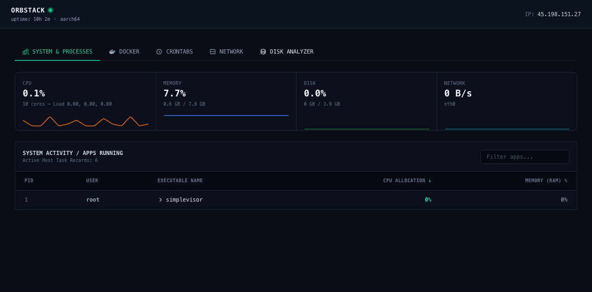

# Sentinel

Simple server monitoring dashboard in a Docker container.



## Features

- **System overview** — CPU, memory, disk, and network sparklines with 15-point history
- **Process table** — live host processes with search and sort (CPU, RAM, PID)
- **Docker tab** — container status, image, CPU, and memory usage via Docker socket
- **Crontabs** — reads system cron files with human-readable schedule summaries
- **Network** — NIC interfaces, RX/TX stats, and listening socket matrix with process mapping
- **Disk analyzer** — partition mounts and largest directory sizes (cached hourly scan)

## Run

```bash
docker compose up -d --build
```

Open **http://localhost:8080**

### Manual Docker run

```bash
docker run -d --name sentinel \
  --net=host --pid=host \
  -v /var/run/docker.sock:/var/run/docker.sock:ro \
  -v /:/host:ro \
  -e HOST_PREFIX=/host \
  sentinel
```

## API

- `GET /api/telemetry` — dashboard data (`?search=` and `?sort=cpu|mem|pid` for processes)
- `GET /api/health` — health check
